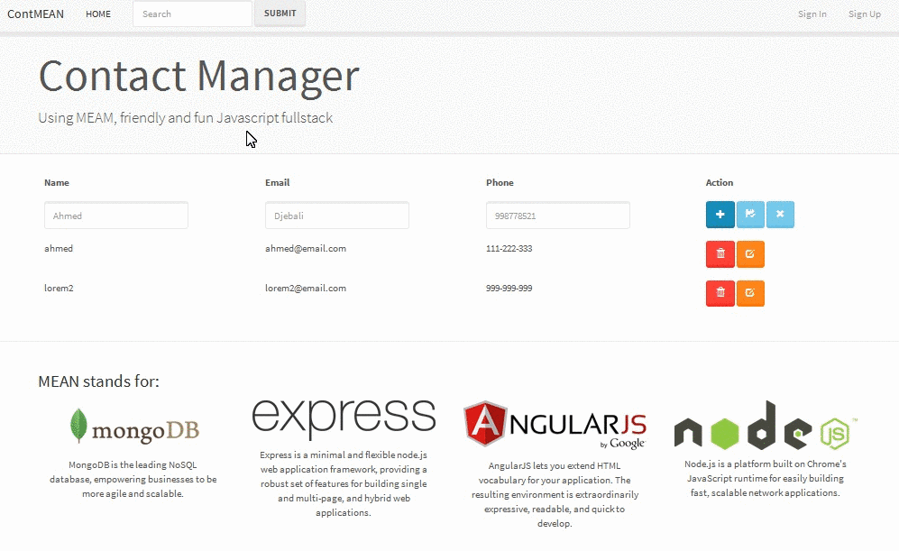

# Demo

#Install & Run 

Download the application

<pre>
  <code>$ git clone git@github.com:geektech893916/mean-stack-contact-manager.git</code>
</pre>

Install

<pre>
  <code>
    $ cd mean-stack-contact-manager
    $ npm install
  </code>
</pre>

Run

<pre>
  <code>$ node server.js</code>
</pre>